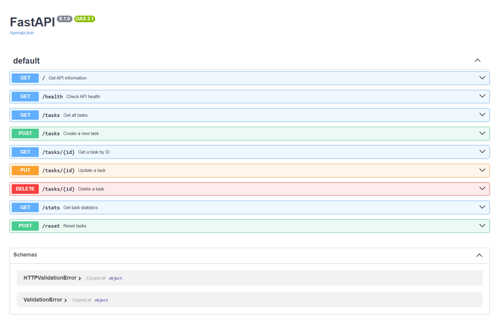

# Task API

A REST API built with **FastAPI**, **PostgreSQL**, and **Docker** for managing tasks.

This project demonstrates the fundamental CRUD (Create, Read, Update, Delete) operations using PostgreSQL for persistent storage. The entire application runs with Docker Compose and provides automatically generated interactive documentation using Swagger UI.
---

# Features

- Create a new task
- Get all tasks
- Get a task by ID
- Update a task
- Delete a task
- Filter tasks by completion status
- Search tasks by title
- Store tasks permanently using PostgreSQL
- Run the entire application with Docker Compose
- Interactive Swagger UI documentation

---

# Technologies

- Python
- FastAPI
- Uvicorn
- PostgreSQL
- Docker
- Docker Compose
- Psycopg

---

# Database

This project uses **PostgreSQL** running inside a Docker container.

The application automatically:

- Connects to PostgreSQL using the `DATABASE_URL` environment variable
- Creates the `tasks` table if it does not exist
- Inserts the three example tasks only when the table is empty

Database data is stored in a Docker volume, so tasks remain available even after restarting the containers.
---

# Installation

Clone the repository:

```bash
git clone https://github.com/ParmidaAzhir/task-api.git
```

Go into the project folder:

```bash
cd task-api
```

Copy the example environment file:

```bash
cp .env.example .env
```

Start the application:

```bash
docker compose up --build
```

---

# API URLs

API:

```text
http://127.0.0.1:8000
```

Swagger UI:

```text
http://127.0.0.1:8000/docs
```

---

# API Endpoints

| Method | Endpoint | Description |
|---------|----------|-------------|
| GET | `/` | Get API information |
| GET | `/health` | Check API health |
| GET | `/tasks` | Get all tasks |
| GET | `/tasks?done=true` | Filter completed tasks |
| GET | `/tasks?search=text` | Search tasks by title |
| GET | `/tasks/{id}` | Get a task by ID |
| POST | `/tasks` | Create a new task |
| PUT | `/tasks/{id}` | Update a task |
| DELETE | `/tasks/{id}` | Delete a task |

---

# Example Request

Create a task:

```http
POST /tasks
```

Request body:

```json
{
  "title": "Study FastAPI"
}
```

Response:

```json
{
  "id": 4,
  "title": "Study FastAPI",
  "done": false
}
```

Status code:

```text
201 Created
```

---

# Example SQL Query

Return all tasks:

```sql
SELECT * FROM tasks;
```

This query can be executed using:

- psql
- pgAdmin
- TablePlus
- DBeaver

---

# Database Screenshot

The PostgreSQL database was inspected after running the application with Docker Compose.

## Database Screenshot


---

# Swagger UI

FastAPI automatically generates interactive API documentation.

Open:

```text
http://127.0.0.1:8000/docs
```

Every endpoint can be tested directly from the browser using the **Try it out** button.

# Swagger Screenshot



---

# Project Structure

```text
task-api/
│
├── main.py
├── repository.py
├── Dockerfile
├── compose.yaml
├── requirements.txt
├── .env.example
├── README.md
└── .gitignore
```

---

# Assignment Progress

## Assignment 1

- Built a REST API using FastAPI
- Implemented CRUD operations
- Added filtering and search
- Added Swagger UI documentation

## Assignment 2

- Replaced the in-memory task list with SQLite
- Created the database automatically
- Created the table automatically
- Inserted example tasks only on the first run
- Replaced CRUD operations with SQL queries
- Executed SQL queries manually using DB Browser for SQLite

---
## Assignment 3

- Migrated the API from SQLite to PostgreSQL
- Connected FastAPI to PostgreSQL using Psycopg
- Stored the connection string in a `.env` file
- Moved database logic into `repository.py`
- Containerized the application with Docker
- Used Docker Compose to run the API and PostgreSQL together
- Added persistent storage using Docker volumes

# Author

**Parmida Azhir**
